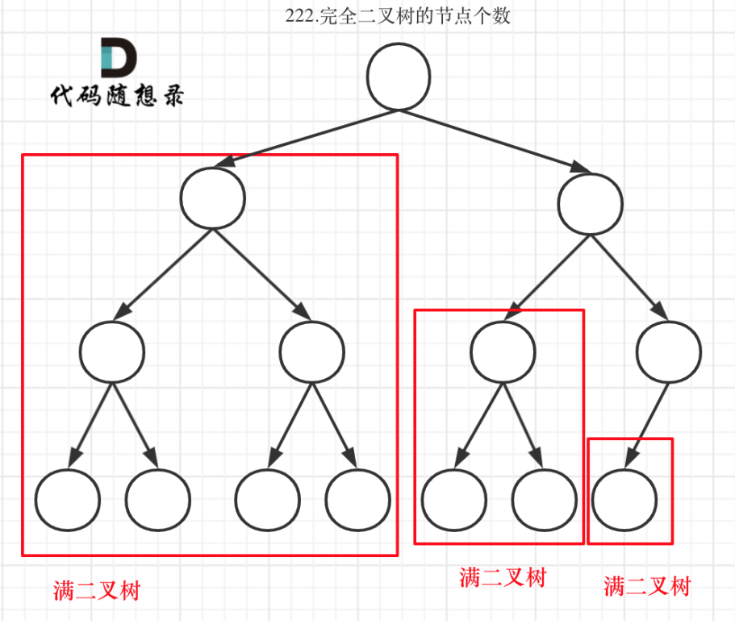
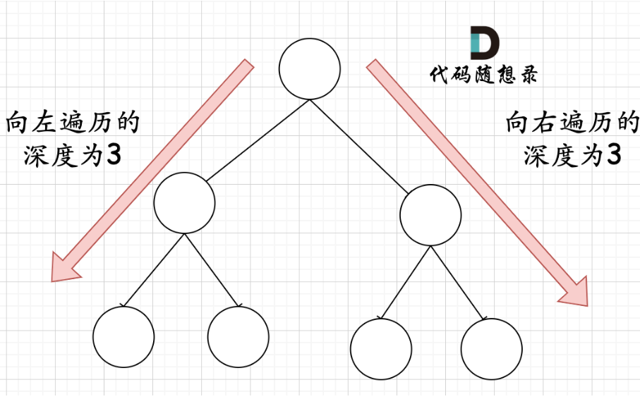

### 110.平衡二叉树
看到这题我的思路就是求高度算差值，看了题解才发现可以在求深度的同时就判定是否不平衡并剪枝
最后没想到的是居然还能犯打错字符的错，看来以后变量命名还是少偷懒
```cpp
class Solution {
public:
    int depth(TreeNode* root){
        int d = 0;
        if(!root)return 0;
        d++;
        int l = depth(root->left);
        if(l == -1)return -1;
        int r = depth(root->right);
        if(r == -1)return -1;
        if(abs(l-r)>1){
            return -1;
        }else{
            return d + max(l, r);
        }
    }
    bool isBalanced(TreeNode* root) {
        if(depth(root) == -1)return false;
        return true;
    }
};
```

### 257. 二叉树的所有路径
完全不知道该怎么写回溯啊...看了题解提示，有一次带push的递归，就有一次回溯，似乎有点理解了
询问chatgpt,得知如果我一定要用迭代法，应该也是类似递归的逻辑：

1. 每次将当前节点和路径压入栈。
2. 如果当前节点是叶子节点，则把路径加入结果。
3. 否则，将右子树和左子树（如果存在）分别入栈，并将路径扩展。

如果删改执行逻辑，就算多弹出一次节点，到了外层while的下一个循环又会从左节点开始重复遍历

```cpp
s.push_back(path[i]); // ❌
```

在 `string` 中直接用 `push_back(int)`，会被当作 ASCII 字符写进去，而不是数字！  
应该改成：

```cpp
s += to_string(path[i]);
```
这里我path传值不传引用，隐式使用了迭代法函数栈的特性来回溯path：
```cpp
#include<stack>
using namespace std;
class Solution {
public:
    string vecString(vector<int>& path){
        string s;
        for(int i = 0;i<path.size();i++){
            s += to_string(path[i]);
            if(i != (path.size()-1))s.append("->");
        }
        return s;
    }
    void traverse(TreeNode* root, vector<int>path, vector<string>&result){
        path.push_back(root->val);
        if(!root->left && !root->right){
            result.push_back(vecString(path));
        }
        if(root->left){
            traverse(root->left, path, result);
        }
        if(root->right){
            traverse(root->right, path, result);
        }
    }
    vector<string> binaryTreePaths(TreeNode* root) {
        vector<int> path;
        vector<string> result;
        traverse(root, path, result);
        return result;
    }
};
```

### 404.左叶子之和
我直接防御型编程
```cpp
class Solution {
public:
    int sumOfLeftLeaves(TreeNode* root) {
        int sum = 0;
        if(!root){
            return 0;
        }else if(!root->left){
            sum += 0;
        }else if(!root->left->left && !root->left->right){
            sum += root->left->val;
        }else{
            sum += sumOfLeftLeaves(root->left); // if(root->left)
        }
        if(root->right)sum += sumOfLeftLeaves(root->right);
        return sum;
    }
};
```

### 222.完全二叉树的节点个数
$O(n)$写法：
```cpp
class Solution {
public:
    int countNodes(TreeNode* root) {
        int cnt = 0;
        if(!root)return cnt;
        cnt++;
        if(root->left)cnt += countNodes(root->left);
        if(root->right)cnt += countNodes(root->right);
        return cnt;
    }
};
```
使用完全二叉树的性质：
完全二叉树只有两种情况，情况一：就是满二叉树，情况二：最后一层叶子节点没有满。

* 对于情况一，可以直接用 2^树深度 - 1 来计算，注意这里根节点深度为1。
* 对于情况二，分别递归左孩子，和右孩子，递归到某一深度一定会有左孩子或者右孩子为满二叉树，然后依然可以按照情况1来计算

在完全二叉树中，如果递归向左遍历的深度等于递归向右遍历的深度，那说明就是满二叉树

可以达到$O(log n × log n)$时间复杂度

#### ✅ 推荐修正版本如下：
```cpp
class Solution {
public:
    int countNodes(TreeNode* root) {
        if (!root) return 0;
        TreeNode* left = root;
        TreeNode* right = root;
        int leftDepth = 0, rightDepth = 0;
        while (left) {
            leftDepth++;
            left = left->left;
        }
        while (right) {
            rightDepth++;
            right = right->right;
        }
        if (leftDepth == rightDepth) {
            // 是满二叉树
            return (1 << leftDepth) - 1;
        }
        // 不是满二叉树，递归统计
        return 1 + countNodes(root->left) + countNodes(root->right);
    }
};
```