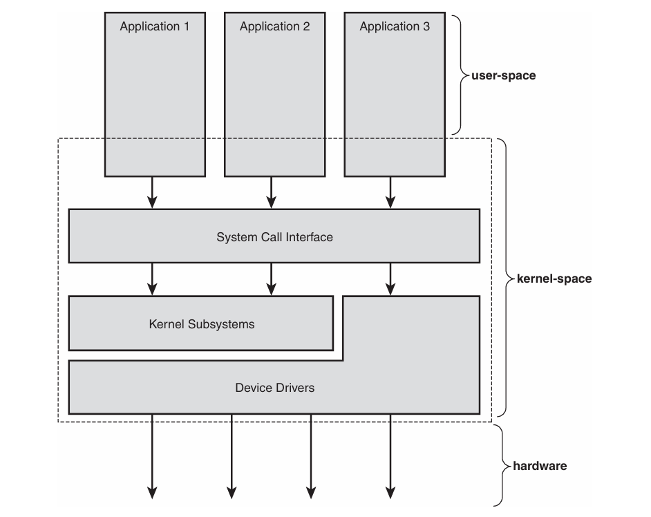

总结一下课堂笔记，不然总是放在不知道哪个作业文件夹里找不到

### 操作系统与内核概述
**内核**是操作系统的最核心部分，负责管理硬件资源（如CPU、内存、硬盘等），并为上层软件提供服务。内核运行在“内核空间”，拥有对硬件的完全控制权，而普通应用程序运行在“用户空间”，只能通过内核提供的接口访问硬件。

应用程序与内核的交互主要通过**系统调用**完成。比如：

- 当你在 C 语言程序里调用 `printf("hello\n")` 时，实际上发生了多层调用。`printf()` 负责格式化和缓冲数据，最终会调用 `write()` 函数，把数据写到终端。`write()` 是一个库函数，它最终会触发 `write` 系统调用，由内核把数据真正输出到屏幕。
- 类似地，`open()` 库函数几乎只做一件事，就是调用 `open` 系统调用，让内核帮你打开一个文件。
- 还有一些库函数，比如 `strcpy()`，只是单纯地在内存中复制数据，根本不会和内核打交道。

**简单来说：**
- 你写的应用程序通过库函数（如 `printf()`、`open()`）间接或直接调用系统调用（如 `write`、`open`），由内核完成实际的硬件操作。
- 有些库函数（如 `strcpy()`）只在用户空间工作，不需要内核参与。

**内核还负责处理中断**。比如你敲键盘时，键盘控制器会发出中断信号，内核收到后会执行相应的中断处理程序，把你输入的内容读出来。

在任何给定时刻，每个处理器正在做以下三件事中的一件：

- 在用户空间，在进程上下文中执行用户代码
- 在内核空间，在进程上下文中，代表特定进程执行操作（包括空闲进程）
- 在内核空间，在中断上下文中，不与任何进程关联，处理中断

### Linux 与经典 Unix 内核设计
- **单一内核/宏内核（Monolithic Kernel）**  
  经典 Unix 和 Linux 都采用单一内核设计。单一内核就是把所有核心功能（如进程管理、内存管理、文件系统、驱动等）都放在一个大程序里，在同一个内存空间中运行。这样做的好处是：  
  - 内核内部各部分可以直接调用彼此的函数，通信效率高，性能好。
  - 设计和实现相对简单。

- **微内核（Microkernel）**  
  微内核把内核功能拆分成多个独立的“服务器”，有的在内核空间，有的在用户空间。它们之间通过消息传递（IPC）通信。优点是：  
  - 各部分相互隔离，一个崩溃不会影响其他部分，系统更稳定。
  - 更容易替换和扩展功能。
  缺点是：  
  - 消息传递比直接函数调用慢，频繁切换上下文会影响性能。
  - 实际上，很多微内核系统（如 Windows NT、Mach）为了性能，后来又把大部分服务放回了内核空间。

- **Linux 的做法**  
  Linux 是单一内核，但吸收了微内核的一些优点，比如模块化设计、支持内核线程、可以动态加载内核模块等。  
  - Linux 所有核心功能都在内核空间，通信用直接函数调用，性能高。
  - 同时，Linux 也很灵活，可以按需加载或卸载功能模块。

Linux 虽然继承了 Unix 的理念和 API，但并不基于任何特定 Unix 变体，因此可以灵活选择或创新最佳技术方案。

- **动态内核模块**：Linux 支持内核模块的动态加载和卸载，增强了灵活性和可扩展性。
- **对称多处理器（SMP）支持**：Linux 从早期就支持 SMP，而许多传统 Unix 系统最初并不支持。
- **抢占式内核**：Linux 内核支持抢占，允许内核任务被中断，提高了实时性和响应速度，而大多数传统 Unix 内核不是抢占式的。
- **线程与进程统一**：Linux 内核不区分线程和进程，所有进程本质上是一样的，只是有些进程共享资源。
- **面向对象的设备模型**：Linux 采用了现代的设备管理方式，如设备类、热插拔和 sysfs。
- **精简与创新**：Linux 有选择地实现功能，忽略了被认为设计不佳或无实际价值的传统 Unix 特性（如 STREAMS）。
- **开放与自由**：Linux 的功能集来源于开放的开发模式，只有经过充分论证、设计清晰、实现扎实的功能才会被采纳。

### Linux 内核版本
*   **稳定版 (Stable)：** 次版本号为**偶数** (如 2.4, 2.6, 4.18, 5.10)。适合生产环境部署，主要更新是错误修复和新驱动。
*   **开发版 (Development)：** 次版本号为**奇数** (如 2.5, 3.1)。代码快速变化，包含实验性功能，不稳定。
*   **版本号格式：** `主版本.次版本.修订版本[.稳定版本]` (如 `2.6.30.1`)。
    *   `主版本.次版本` 定义内核系列 (如 2.6)。
    *   `修订版本` 表示同一系列内的主要发布。
    *   `.稳定版本` (可选) 表示在主要发布后的小更新，专注于关键错误修复。

