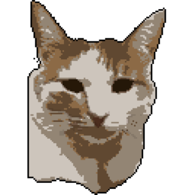

#### 友情链接

   

      
      

         

            

               
               

                  

                     <a href="https://something.plus/">一颗荔枝味汤圆</a>
                  

                  
荔枝老师今天干嘛啦？

               

            

            

               
               

                  

                     <a href="https://erlkonig.tech/">erlkonig</a>
                  

                  
啊？

               

            

            

               
               

                  

                     <a href="https://expoli.tech/">糖醋鱼</a>
                  

                  
🐟生成长记

               

            

            

               
               

                  

                     <a href="https://cjsy.cc/">熙泱露</a>
                  

                  
记录是时间最好的解药。

               

            

            

               
               

                  

                     <a href="https://goloaf.top/">Cyberl0afing</a>
                  

                  
摸鱼动力——一个专注于Compiler和计算机杂学的小站

               

            

         

      

   

